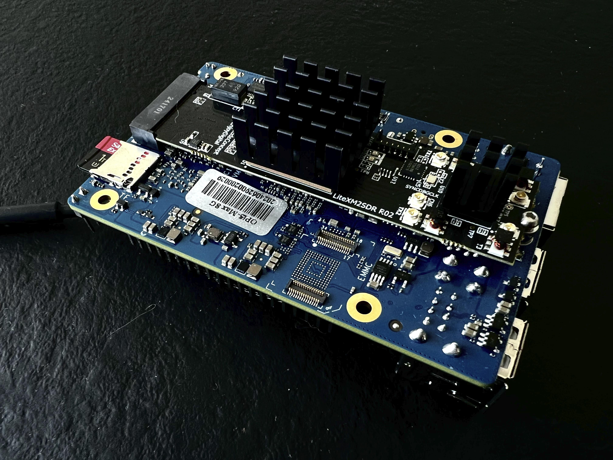
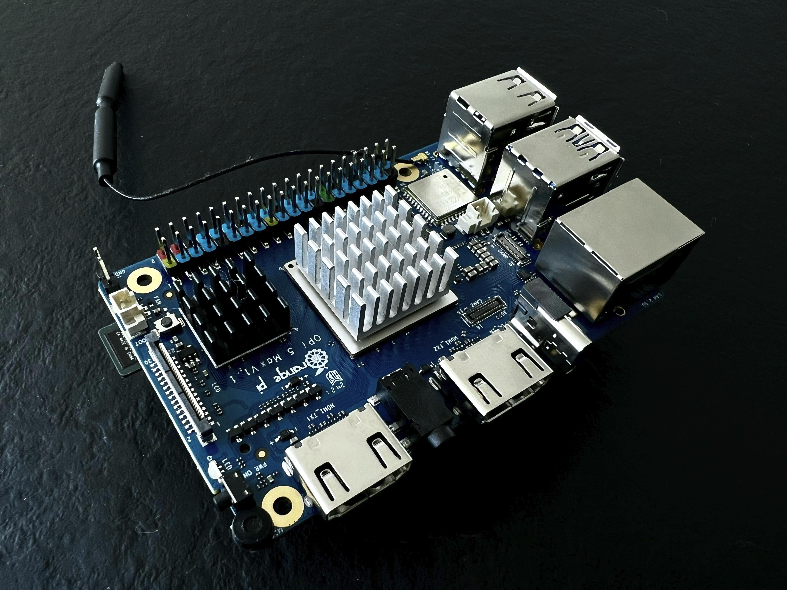
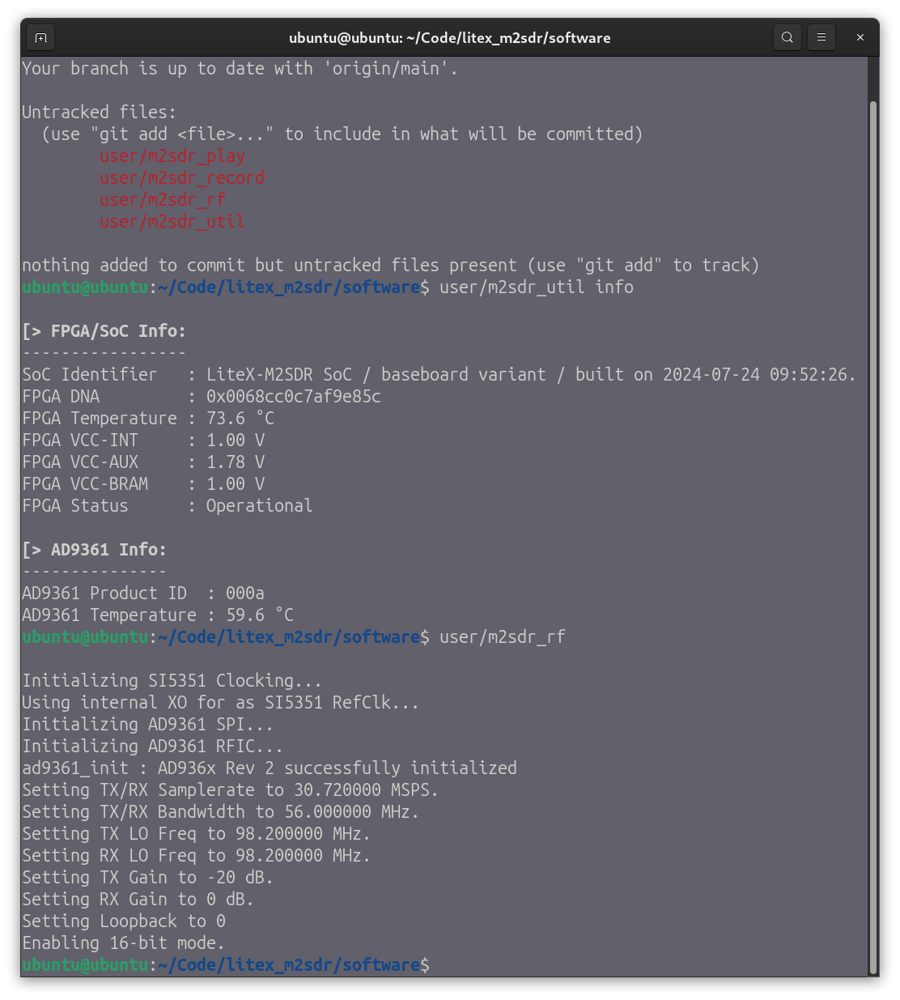

# Running LiteX-M2SDR on OrangePI 5 Max Linux

Below you can see a the [LiteX-M2SDR](../..) installed on an [OrangePi 5 Max](http://www.orangepi.org/html/hardWare/computerAndMicrocontrollers/details/Orange-Pi-5-Max.html). Please follow this Step-by-Step tutorial below to get your SDR running.




## Create MicroSD card image

Please make sure to use a [fast MicroSD card of 64GB or bigger](https://www.amazon.com/dp/B09X7BYSFG). We're using the [Rockchip community project maintained by Joshua Riek](https://github.com/Joshua-Riek/ubuntu-rockchip/).
You can download the latest [Ubuntu 24.04 base image for OrangePI 5 Max here](https://joshua-riek.github.io/ubuntu-rockchip-download/boards/orangepi-5-max.html).

```bash
# Download base image ...
curl -L -O https://github.com/Joshua-Riek/ubuntu-rockchip/releases/download/v2.3.1/ubuntu-24.04-preinstalled-server-arm64-orangepi-5-max.img.xz

# ... and write to MicroSD card plugged into the /dev/sdg drive.
# Please replace /dev/sdg by your MicroSD disc drive (see below)
xzcat ubuntu-24.04-preinstalled-server-arm64-orangepi-5-max.img.xz | sudo dd bs=128M of=/dev/sdg

# Ensure that all data is written by flushing disc caches.
sync

# You can unplug the MicroSD card now
```

By using `fdisk` you can list all disc drives and check where your MicroSD card is plugged in:
```bash
sudo fdisk -l
```

## Wiring up and running your OrangePI board

Please plug in your Ethernet cable, HDMI monitor, USB keyboard and your MicroSD card generated earlier. You can power your OrangePI now over the USB-C port by using a 5V@5A power supply.

For the first login your OrangePI system will prompt you to change the default user password on your HDMI monitor. It will then print its DHCP IP address.


## First login into Orange PI and update of the base image

You can login now over ssh using the IP show earlier and the user password you changed to:
```bash
ssh ubuntu@10.254.1.21

# ... and update the freshly installed system
sudo apt update
sudo apt upgrade
sudo reboot
```

## Installing LiteX-M2SDR on OrangePI

Please insert you LiteX-M2SDR module before powering your updated OrangePI. You require an M2x3mm screw for locking the SDR module in place.

```bash
# Login over ssh using your IP and password
ssh ubuntu@10.254.1.21

# On OrangePI, clone the LiteX-M2SDR source tree
mkdir Code
cd Code
git clone https://github.com/enjoy-digital/litex_m2sdr

# Compile the LiteX-M2SDR Linux kernel driver for arm64 ...
cd litex_m2sdr/software/kernel
# Note that this line not only compiles the driver, but also activates it
sudo ARCH=arm64 ./init.sh 

# Now compile the command line tools and the SoapySDR driver for LiteX-M2SDR
cd ..
# Install missing dependencies ...
sudo apt install -y cmake soapysdr-tools libsoapysdr0.8 libsoapysdr-dev
# ... compile command line tools and SoapySDR driver
./build

# Verify list of compiled tools
git status

# If you want to play around later with LiteX-M2SDR Python tools
sudo apt install -y python3-numpy
```

## Playing around with LiteX-M2SDR on OrangePI
```bash
user/m2sdr_util info
user/m2sdr_rf
```

On subsequent boots you need to manually insert the litexPCI driver and make it accessible to your unprivileged user for avoiding the `sudo` command:
```bash
sudo modprobe ~/Code/litex_m2sdr/software/kernel/litepcie.ko
sudo chmod 666 /dev/m2sdr0
# Check whether it works
~/Code/litex_m2sdr/software/user/m2sdr_util info
```
Example LiteX session:


---
> Ubuntu is a trademark of Canonical Ltd. Rockchip is a trademark of Fuzhou Rockchip Electronics Co., Ltd. The Ubuntu Rockchip project is not affiliated with Canonical Ltd or Fuzhou Rockchip Electronics Co., Ltd. All other product names, logos, and brands are property of their respective owners. The Ubuntu name is owned by [Canonical Limited](https://ubuntu.com/).
