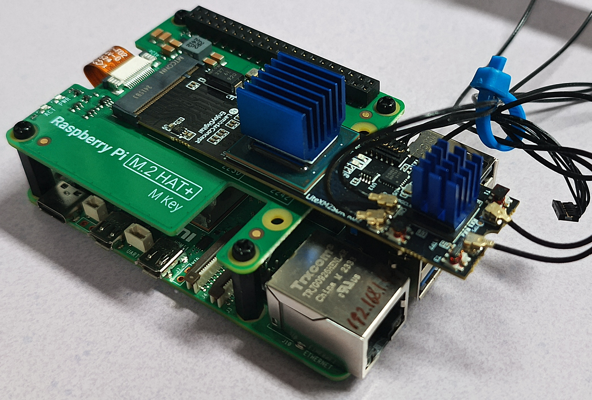
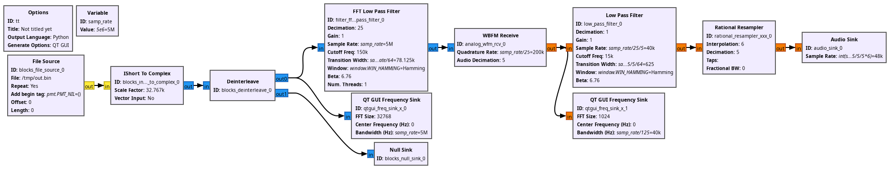
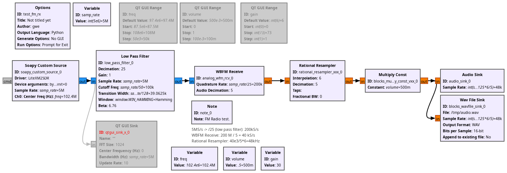

# Running LiteX-M2SDR on the Raspberry Pi 5

The M2SDR is connected to the Raspberry Pi 5 through the M2 HAT found at
https://www.kubii.com/fr/raspberry-pi-5/4114-m2-hat-plus-5056561803463.html



Using the PCI board providing JTAG access on the USB-C connector, flash the 
``litex_m2sdr_m2_pcie_operational.zip`` bitstream found
at https://github.com/enjoy-digital/litex_m2sdr/issues/30 using 
```
openFPGALoader -c ft4232 --fpga-part xc7a200tsbg484 --freq 20e6 -f litex_m2sdr_m2_pcie.bin 
```

## Using the binary Raspberry Pi OS

Use ``kernel=kernel8.img`` in accordance with
https://github.com/raspiblitz/raspiblitz/issues/4346 for using 4 KB memory page
size rather than the default kernel using 16 KB memory page size which confuses
DMA allocation.

Append the ``config.txt`` in the first FAT partition with
```
[cm5]
dtoverlay=dwc2,dr_mode=host

kernel=kernel8.img

[all]
dtparam=pciex1=on
dtoverlay=pcie-32bit-dma-pi5
dtoverlay=pciex1-compat-pi5,l1ss=off,no-l0s=on,no-mip=off
```

Append at the end of the ``cmdline.txt`` in the fist FAT partition the Linux 
kernel options
```
pci=noaer pcie_aspm=off iommu.passthrough=1 arm-smmu.disable=1
```

## Testing with M2SDR tools

Follow the testing sequence described at 
https://github.com/enjoy-digital/litex_m2sdr/issues/18 and ending, if all tests
are positive, with

```
./m2sdr_rf --rx_freq 102.4e6 --rx_gain 70 --samplerate 5e6
./m2sdr_record /tmp/out.bin 750000000
```
which is postprocessed with the GNU Radio flowchart



identifying how data are stored as interleaved complex short (16 bit) integers.

## Testing with GNU Radio

The [following flowchart](raspberry-pi-5_FM.grc) is used to demonstrate 
continuous data acquisition at 5 Msamples/s and real time decoding of the 
commercial wideband analog FM signal using the M2SDR Soapy source. 
Tune to your local station frequency.


